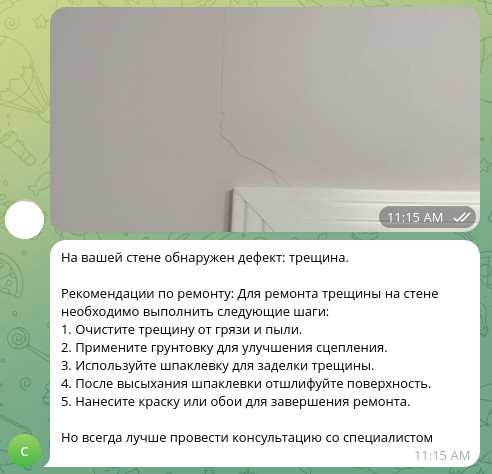
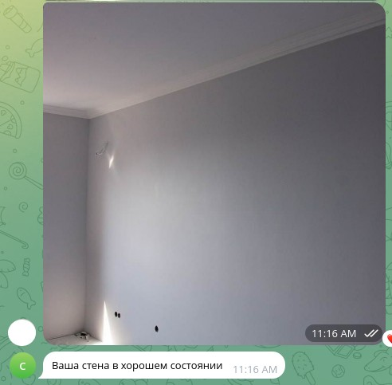

# Apartment Layout Control

В рамках данного проекта разрабатывается алгоритм анализа качества ремонта стен с помощью LLM. В качестве интерфейса для демонстрации работы данного алгоритма выступает телеграмм бот.

## Контакты
По всем вопросам о данном проекте можно написать мне в личку: [@matweykai](https://t.me/matweykai)

## Как запустить проект?

### Настраиваем переменные окружения
1. Копируем `.env.example` в `.env`:
   ```bash
   cp .env.example .env
   ```
2. Обновляем [`.env`](.env) своими настройками

### Локально
1. Клонируем репозиторий
2. Устанавливаем зависимости через poetry:
   ```bash
   poetry install
   ```
3. Настраиваем переменные окружения

### Docker
1. Клонируем репозиторий
2. Настраиваем переменные окружения
3. Собираем образ и запускаем контейнер
```bash
# Build the image
docker build -t telegram-bot .

# Run the container
docker run -d --env-file .env telegram-bot
```

### Примеры работы


