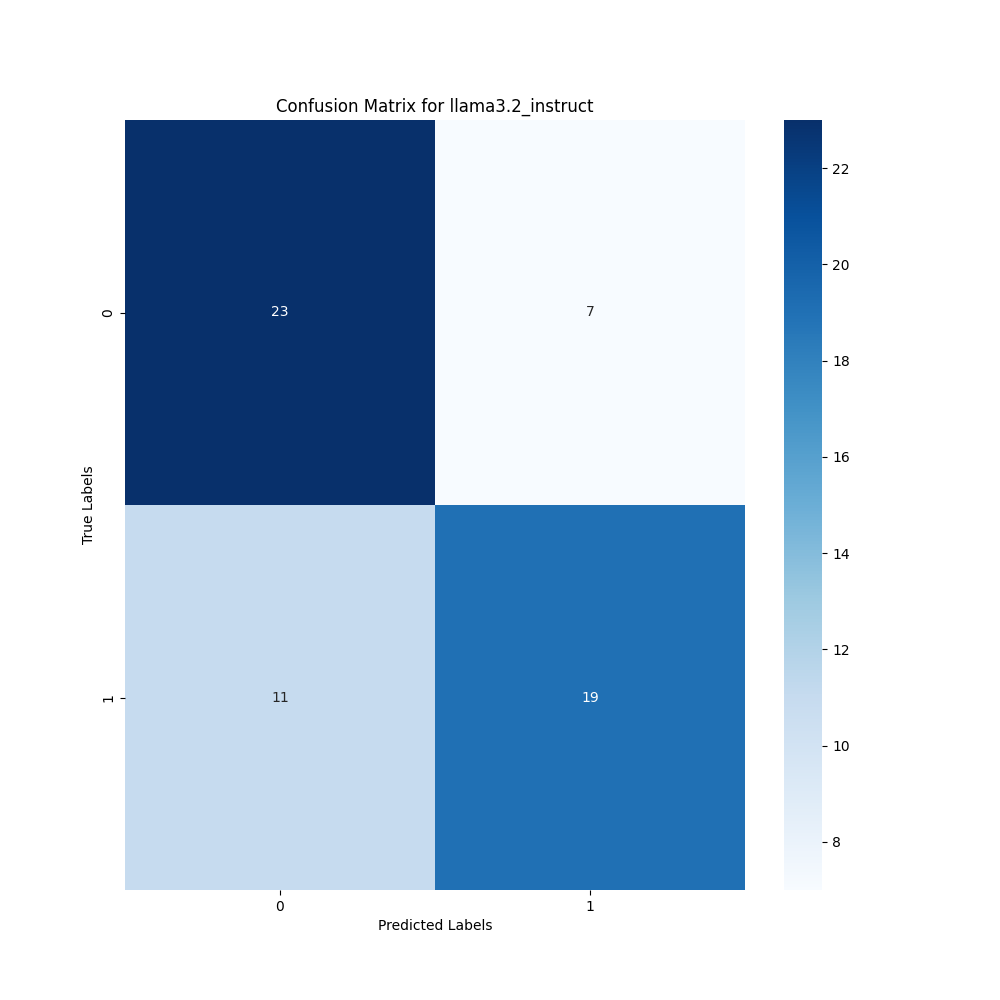
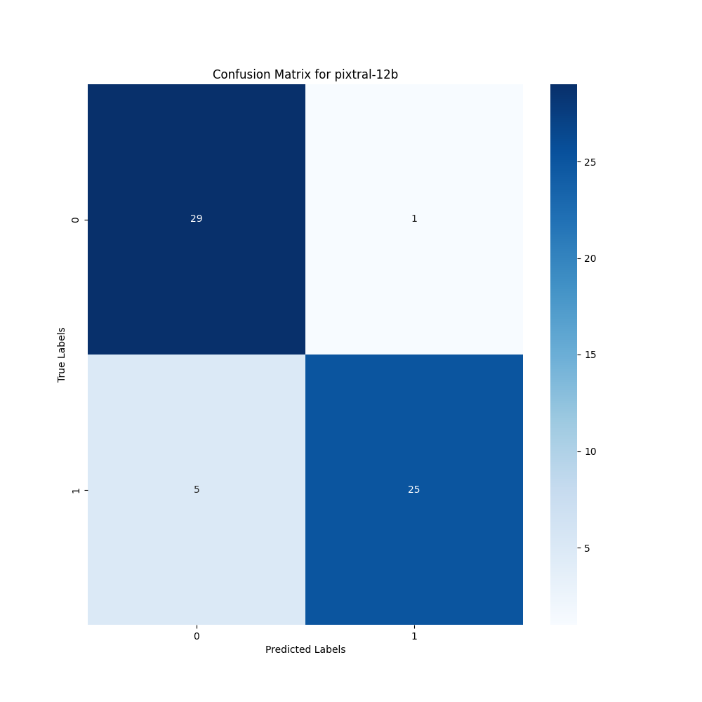

# Эксперименты с моделью

## 0. Оценка бейзлайн модели
В качестве бейзлайн модели используется LLaMA 3.2 3B Instruct, с простым промптом:
```
Can you see any repairing defects on this wall? Answer only 'yes' or 'no'.
```

Далее в ответе находилось слово 'yes' или 'no'. Они переводятся в метки для классификации и оцениваются с помощью матрицы сопряжённости и метрики Accuracy.
Для бейзлайн модели результат оказался не очень хорошим:
- 0.7 Accuracy
- Матрица сопряжённости


Выводы:
- По матрице видно, что модель пропускает дефекты
- В целом модель даже с таким простым промптом может находить дефекты

## 1. Перебор различных вариантов модели (Оценка бейзлайн модели)
Для того, чтобы подобрать наиболее оптимальную модель был выполнен перебор моделей через [скрипт](../scripts/test_model.py). Были выбраны модели, которые подходят по цене за токен, а также их время инференса было меньше 7 секунд.

| Название модели  | Accuracy (Val) | Скорость работы (с) | Цена ($/1M) |
| ------------- | ------------- | ------------- | ------------- |
| claude-3-haiku | 0.28 | 3.2 | 0.8 |
| gemini-flash-1.5 | 0.32 | 1.9 | 0.15 |
| pixtral-12b | 0.77 | 2.3 | 0 |
| qwen-2-vl-7b | 0.5 | 5.2 | 0.1 |
| qwen-2-vl-72b | 0.55 | 7.4 | 0.4 |

Промпт, остался таким же как и у Baseline модели.

## 2. Эксперименты с подбором промпта
Итеративно происходило улучшение промпта, от более простого варианта к сложным. В директории `experimental_prompts` собраны промпты, которые были опробованы в рамках тестовых запусков. По результатам экспериментов с промптами была составлена таблица:

| Эксперимент  | Accuracy (Val) | Скорость работы (с) | Комментарии |
| ------------- | ------------- | ------------- | ------------- |
| exp_1.0 | 0.79 | 2.32 | Дополнена информация о задаче |
| exp_1.1 | 0.78 | 2.34 | -
| exp_1.2 | 0.76 | 2.28 | -
| exp_1.3 | 0.77 | 2.36 | -
| exp_1.4 | 0.73 | 2.31 | -
| exp_1.5 | 0.76 | 2.35 | -
| exp_2.0 | 0.82 | 2.51 | Добавлены указания для работы с JSON |
| exp_2.1 | 0.79 | 2.59 | - 
| exp_2.2 | 0.80 | 2.54 | - 
| exp_2.3 | 0.76 | 2.49 | - 
| exp_2.4 | 0.79 | 2.58 | -
| exp_2.5 | 0.81 | 2.53 | -
| exp_3.0 | 0.87 | 2.78 | Добавлена строгая структура JSON с чёткими полями |
| exp_3.1 | 0.85 | 2.65 | -
| exp_3.2 | 0.83 | 2.68 | -
| exp_3.3 | 0.84 | 2.71 | -
| exp_4.0 | 0.79 | 2.95 | Добавлен механизм Chain Of Thoughts
| exp_4.1 | 0.76 | 2.89 | -
| exp_4.2 | 0.83 | 2.94 | -
| exp_4.3 | 0.81 | 2.92 | -
| exp_5.0 | 0.87 | 2.75 | Удалён Chain Of Thoughts и переписан промпт для увеличения кол-ва покрываемых случаев
| exp_5.1 | 0.89 | 2.78 | -
| exp_5.2 | 0.91 | 2.71 | -
| exp_5.3 | 0.86 | 2.69 | -

В итоге был выбран результат с эксперимента exp 5.2. Матрица сопряжённости для актуальной конфигурации:


Выводы:
- Получилось в целом улучшить модель по метрикам качества
- По таблице видно, что больший промпт замедляет модель и может не давать улучшения качества
- Модель начала лучше находить дефекты