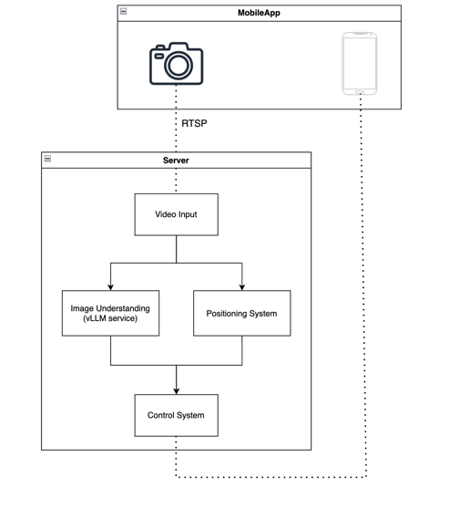

# ML System Design Doc - [RU]
## Дизайн ML системы - Apartment Layout Control

### 1. Цели и предпосылки 
#### 1.1. Зачем идем в разработку продукта?  

#### Бизнес-цель:
Данный продукт должен повысить эффективность мониторинга качества выполняемых работ. В данный момент на одного бригадира приходится около 100 бригад, что требует от него большого кол-ва времени на оценку каждого этапа выполнения ремонтных работ.

#### Почему станет лучше, чем сейчас, от использования ML:
В данный момент процесс оценки качества выполняемых работ происходит вручную, а с разработкой данного продукта процесс можно автоматизировать. Использование ИИ в данном случае сильно упрощает построение алгоритмов для оценки качества, а также делает данный подход расширяемым и гибким. В данном случае используется VLLM, тк в отличии от других CV подходов, она может распознавать новые классы в формате Zero-Shot, а также может создавать рекомендации по изображению.

#### Что будем считать успехом итерации с точки зрения бизнеса:
В данной итерации планируется построить алгоритм, который умеет находить дефект и выдавать рекомендации по его устранению. Проект будет успешным, если точность классификации изображений с дефектами и без будет выше 90%, а также рекомендации будут релевантными в 85% случаев.

Собранный датасет для оценки качества работы модели является сбалансированным (30 положительных и 30 отрицательных примеров), поэтому для оценки качества модели будет использоваться Accuracy. Классы: есть дефект или нет дефекта.

$Accuracy = \sum_i{gt_i = pred_i}$

#### 1.2. Бизнес-требования и ограничения  

#### Краткое описание БТ и ссылки на детальные документы с бизнес-требованиями:
- Загрузка изображения в телеграмм бот
- Формат обрабатываемых картинок (PNG, JPEG)
- Дефект должен быть классифицирован (трещина, плесень и тд)
- Должны быть даны рекомендации по устранению дефекта

#### Бизнес-ограничения:
- Работа с моделями организуется только через API
- Стоимость одного запроса не должна превышать 0.1$
- Время на обработку одного изображения должно быть меньше 7 секунд

#### 1.3. Что входит в скоуп проекта/итерации, что не входит   

#### На закрытие каких БТ подписываемся в данной итерации:
- Создание телеграмм бота для обработки входящих изображений
- Проведение классификации изображений
- Создание релевантных рекомендаций для пользователя
  
#### Описание результата с точки зрения качества кода и воспроизводимости решения:
- Создание GitHub репозитория с телеграмм ботом и линтером
- Создание MVP алгоритма обработки изображений и генерации рекомендаций по устранению дефектов   

#### Описание планируемого технического долга (что оставляем для дальнейшей продуктивизации):
- Обработка видео
- Внедрение алгоритма в мобильное приложение

#### 1.4. Предпосылки решения  

#### Запросы бизнеса:
- Необходимость повышения эффективности процесса мониторинга
- Наличие потенциального большого рынка сбыта продукта

#### Блоки данных:
- Для проверки качества работы системы будут использоваться изображения собранные из обзоров ремонта

### 2. Методология  

#### 2.1. Постановка задачи  

- С точки зрения ML решается задача классификации изображений
- Также вторичной задачей ML является генерация текста на основе изображения
- Разрабатывается пользовательский интерфейс в виде телеграмм бота

#### 2.2. Блок-схема решения  

В процессе разработки должна быть собранна тестовая выборка, на которой будут оцениваться модели. В данном проекте обучение не предусмотрено. В качестве бейзлайн модели используется детектор дефектов на стенах из [Roboflow](https://universe.roboflow.com/project-ecp30/wall-defect-ogum1/model/1). Процесс обучения здесь заменён на блок экспериментов с промптами и различные модификации LLM системы.

#### 2.3. Этапы решения задачи
##### 2.3.1 Этап 1. Подготовка данных
В рамках данного проекта не производится обучение или дообучение модели, поэтому была собрана небольшая выборка, которая будет поделена на валидацию и тест в соотношении 50 на 50.

Также в качестве предобработки данных все изображения были конвертированы в формат JPEG.

| Название данных  | Есть ли данные в компании | Требуемый ресурс для получения данных | Проверено ли качество данных |
| ------------- | ------------- | ------------- | ------------- |
| Набор тестовых изображений | - | DE/DS | + |

##### 2.3.2 Этап 2. Подготовка бейзлайн решения на основе LLaMA 3.2 3B Instruct
Цель этапа: получить первичные метрики, с которыми в дальнейшем будем сравниваться при улучшении модели.

Результаты этапа:
- Был получен первый промпт, в котором модель на основе картинки отвечает есть ли на ней дефект или нет (Да|Нет)
- Качество модели в данном случае получилось: 0.7 Accuracy

##### 2.3.3 Этап 3. Поиск оптимальной модели
LLama 3.2 3B Instruct может не являться оптимальной моделью, поэтому будет выполнен перебор моделей с помощью API из [OpenRouter](https://openrouter.ai/models), а также [MistralAI](https://mistral.ai/). Рассматриваться будут модели стоимостью до 0.8$ за 1 M токенов. Также важным показателем является время работы, которое в среднем не должно превышать 7 секунд.

Цель: перебрать API и получить оптимальную модель по соотношению цена, качество и скорость работы

| Название модели  | Accuracy (Val) | Скорость работы (с) | Цена ($/1M) |
| ------------- | ------------- | ------------- | ------------- |
| claude-3-haiku | 0.28 | 3.2 | 0.8 |
| gemini-flash-1.5 | 0.32 | 1.9 | 0.15 |
| pixtral-12b | 0.77 | 2.3 | 0 |
| qwen-2-vl-7b | 0.5 | 5.2 | 0.1 |
| qwen-2-vl-72b | 0.55 | 7.4 | 0.4 |

Результаты: по итогам данного этапа была выбрана модель **pixtral-12b**, так как она предоставляется бесплатно в API от MistralAI, а также показывает неплохие метрики по сравнению с другими моделями по качеству и скорости работы

##### 2.3.4 Этап 4. Подбор промпта для ответа в JSON формате
Цель: подобрать промпт, который позволит получать форматированный вывод от модели. Так её будет проще интегрировать в систему.

Результат: добавление специальных фраз по типу:
- Your response must be structured in JSON format with the following fields:
- Don't forget to respond in JSON format

позволило сделать ответ модели структурированным и теперь его проще обрабатывать с помощью pydantic моделей.

##### 2.3.5 Этап 5. Итеративное улучшение промпта
Цель: добавить в промпт более детальную инструкцию и использовать различные техники для улучшения качества работы модели на валидационном датасете

| Версия промпта  | Accuracy (Val) | Что поменялось? |
| ------------- | ------------- | ------------- |
| v1.0 | 0.82 | Добавлена более детальная информация о JSON полях |
| v1.1 | 0.87 | Добавлена строчка с указанием модели, что если она не уверена, то не надо писать о дефекте |
| v1.2 | 0.83 | Протестирован подход chain of thoughts (в результате поле рекомендаций разраслось, но точность работы не улучшилась)
| v2.0 | 0.91 | Описание задачи переформулировано, добавлены указания, что нужно анализировать только визуальную информацию без догадок |

##### 2.3.6 Этап 6. Оценка качества работы на тестовой выборке
Цель: протестировать лучший промпт с этапа №5 на тестовой выборке

Риски: 
- Модель может не достигнуть целевых показателей (возвращаемся на этап 5)
- Рекомендации могут быть не всегда релевантными (не добавлять их в сервис или возвращаемся на этап 5 для улучшения качества в этой части)

### 3. Подготовка пилота
#### 3.1. Способ оценки пилота
Чтобы протестировать работоспособность и полезность прототипа предлагается внедрить данное приложение на объекты стройки, где бригадиры смогут проверить, что данное решение работает, найдут какие-то краевые случае, которые будут в дальнейшем устранены. Оценка пилота производится на основе обратной связи от пользователей. Это возможно, так как в данном случае пилотирование будет проходить на небольшом кол-ве потребителей (около 100 человек), что с одной стороны сможет дать нам какую-то объективную оценку, а с другой не будет огромного кол-ва отзывов, которые мы не сможем отсмотреть глазами.

#### 3.2. Что считаем успешным пилотом
Пилот будет считаться успешным, если собранная обратная связь будет положительной хотя бы в 50% случаев. Таким образом можно будет надеяться на какой-то рынок в строительной отрасли.

#### 3.3. Подготовка пилота
Для того, чтобы запустить пилотный проект необходимо развернуть проект на сервере, с 100% временем доступа к процессору. Мы это планируем делать на Yandex Cloud, где месяц аренды сервера стоит 2,174.60 рублей. Планируемая длительность пилота - 3 месяца + 1 неделю на настройку инфраструктуры. Так как нагрузка будет невысокой, то нам хватит бесплатного тарифа от MistralAI для pixtral-12b.

Итого стоимость пилота: 3.25 месяца * 2 174 ~= 7 066 рублей

### 4. Внедрение
После проведения пилота будет производиться внедрение в контур с продуктами компании. Данный сервис будет использоваться системой автоматического анализа ремонта по видео с смартфона. Данная система будет дополняться модулем анализа позиции камеры относительно квартиры, а также системой планирования движения по видео.

#### 4.1. Архитектура решения
Мобильное приложение отправляет видеопоток на сервер вместе с метаданными, где его обрабатывает Video Input. Данный модуль формирует запросы к сервису анализа картинки и сервису позиционирования. Работа, которая проводится в рамках данного проекта будет внедряться в сервис Image Understanding.

#### 4.2. Описание инфраструктуры и масштабируемости
Для инференса модели был выбран движок [vLLM](https://docs.vllm.ai/). 

Преимущества:
- Простота деплоя и поддержки
- Является open-source инструментом
- Поддерживает openAI совместимое API
- Подгружает модели из Hugging Face, что позволяет в будущем заменить модель при необходимости
- Интеграция с Grafana

Недостатки:
- Отсутствие встроенных инструментов для ускорения модели
- Документация доступна только под VPN

С помощью данного инструмента система может эффективно масштабироваться на одной машине, и этого достаточно, так как не планируется высокая нагрузка и аренда кластера. Важной особенностью данного инструмента является огромное кол-во плагинов, с помощью которых можно подключить данный движок к Grafana и считывать метрики.

#### 4.3. Издержки
Для инференса данного сервиса необходима видеокарта, поэтому планируется аренда сервера для вычислений у Yandex Cloud.
Сервер с конфигурацией:
- GPU = Tesla V100
- RAM = 48 Gb
- CPU = 8
- SSD = 512 Gb

Будет стоить 198 726 рублей в месяц.
